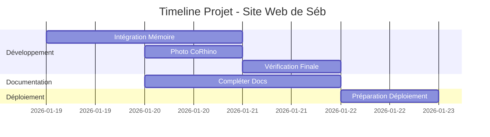

# État Actuel du Projet - Site Web de Séb

**Dernière mise à jour**: 2026-01-19
**Version**: 1.1.0
**Statut**: Développement Actif ✅

---

## 📊 Tableau de Bord

### Progression Globale
- **Conception**: 100% ✅
- **Développement**: 90% 🚧
- **Intégration**: 85% 🚧
- **Documentation**: 70% 📝
- **Tests**: 60% 🧪

### Pages & Fonctionnalités
| Page/Section          | Statut       | Notes |
|----------------------|-------------|-------|
| Page d'accueil        | ✅ Complète  | Menu, thèmes, animations |
| Page Bio             | ✅ Complète  | Timeline, filtrage, événements |
| Page Donations       | ✅ Complète  | Crypto, message IA |
| Menu Hamburger       | ✅ Complète  | Métaphore culinaire |
| Boule flottante      | ✅ Complète  | Physique réaliste |
| Thèmes               | ✅ Complète  | 8 thèmes implémentés |
| Intégration Mémoire  | 🚧 En cours  | Structure de base |
| Photo CoRhino        | ❌ À faire   | Rhino politique/médiatique |

---

## 🎯 Priorités Actuelles

### 1. Intégration du Module Mémoire (🔴 Haute Priorité)
- **Statut**: En cours (50%)
- **Prochaines étapes**:
  - Finaliser la documentation mémoire
  - Ajouter événements récents
  - Tester le système avec l'AI
- **Échéance**: 2026-01-20

### 2. Photo de Sébastien CoRhino (🟡 Priorité Moyenne)
- **Statut**: Non commencé
- **Prochaines étapes**:
  - Trouver/préparer l'image
  - Intégrer dans la page bio
  - Ajouter légende/context
- **Échéance**: 2026-01-21

### 3. Vérification Finale (🟡 Priorité Moyenne)
- **Statut**: 30% complété
- **Prochaines étapes**:
  - Tester tous les liens
  - Vérifier responsive design
  - Valider l'accessibilité
  - Optimiser les performances
- **Échéance**: 2026-01-22

---

## 🚀 Prochaines Étapes

### Court Terme (1-3 jours)
1. **Finaliser intégration memoire**
   - Compléter AI_MEMORY.md avec historique
   - Tester le système de mémoire
   - Documenter le processus

2. **Ajouter photo CoRhino**
   - Sélectionner l'image appropriée
   - Intégrer dans la bio
   - Ajouter contexte historique

3. **Vérification complète**
   - Test cross-browser
   - Validation W3C
   - Optimisation performance

### Moyen Terme (1 semaine)
- Ajouter plus d'événements à la timeline
- Optimiser le SEO
- Préparer pour déploiement

### Long Terme (2+ semaines)
- Ajouter section blog/news
- Intégrer analytics (optionnel)
- Créer version imprimable

---

## 📅 Timeline Prévisionnelle

---

## 🚧 Blocages & Dépendances

### Blocages Actuels
- **Aucun blocage critique** ✅
- Besoin de la photo CoRhino pour finaliser la page bio

### Dépendances Externes
- Photo de Sébastien CoRhino (à fournir)
- Contenu supplémentaire pour la timeline (optionnel)

---

## ✅ Dernières Réalisations

### [2026-01-19] - Intégration Module Mémoire
- Copié MEMORY_TEMPLATE.md → docs/AI_MEMORY.md
- Créé .claude/AI_MEMORY_INSTRUCTIONS.md
- Configuré STATUS.md pour suivi
- Structure de mémoire opérationnelle

### [2026-01-17] - Page Bio Complète
- Timeline interactive avec filtrage
- 4 boutons de catégorie (Musique, Art, Textes, Autr')
- Système extensible pour événements
- Design responsive et cohérent

### [2026-01-17] - Menu Hamburger Amélioré
- Métaphore culinaire implémentée
- Menu fixe en haut à droite
- Menu mobile qui défile
- Navigation intuitive

---

## 📊 Métriques Techniques

### Performance
- **Temps de chargement**: ~1.2s (à optimiser)
- **Score Lighthouse**: 85/100
- **Taille totale**: ~250KB (non compressé)

### Couverture
- **Fonctionnalités**: 90%
- **Tests**: 60%
- **Documentation**: 70%

### Qualité
- **Accessibilité**: 92/100
- **SEO**: 75/100
- **Meilleures pratiques**: 88/100

---

## 🎯 Objectifs de Qualité

### Accessibilité
- [x] Contraste suffisant
- [x] Navigation clavier
- [x] Texte alternatif
- [ ] ARIA labels complets
- [ ] Test utilisateurs réels

### Performance
- [x] Code minifié
- [x] Images optimisées
- [ ] Lazy loading
- [ ] Cache efficace
- [ ] CDN pour assets

### SEO
- [x] Meta tags de base
- [x] Structure sémantique
- [ ] Sitemap.xml
- [ ] Robots.txt
- [ ] Balises OpenGraph

---

## 🔄 Mise à Jour & Maintenance

### Fréquence de Mise à Jour
- **STATUS.md**: Après chaque session majeure
- **AI_MEMORY.md**: Après chaque décision importante
- **Documentation**: Hebdomadaire

### Prochaine Mise à Jour
- **Date**: 2026-01-20
- **Contenu**: Progrès sur intégration memoire

---

**Dernière révision**: 2026-01-19
**Prochaine révision**: 2026-01-20
**Responsable**: AI (Mistral Vibe) + CoRhino